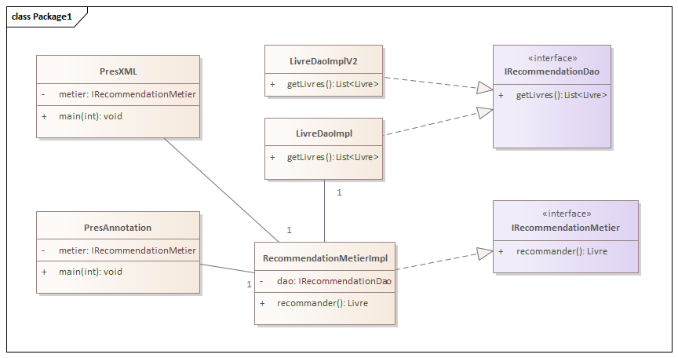
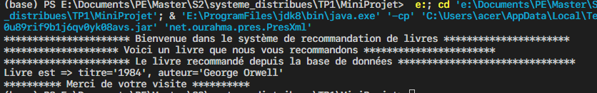
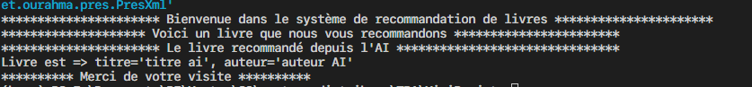
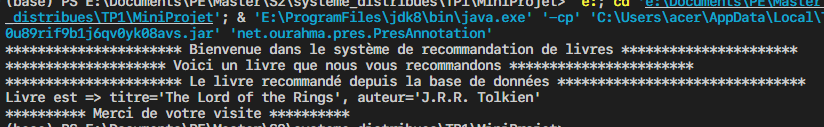
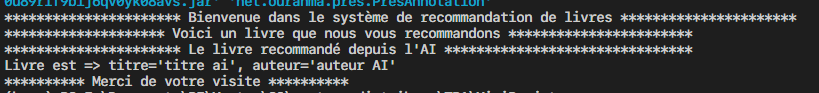

# Projet Spring 

## 1- Introduction
Ce projet Java illustre la mise en œuvre d’un **framework d'injection de dépendances** inspiré de Spring, utilisant à la fois des **fichiers XML** et des **annotations**. Le cœur du projet repose sur un moteur de **recommandation de livres**, extensible selon plusieurs stratégies : depuis une base de données ou via un système de recommandation par IA (Intelligence Artificielle).

L’objectif est d’appliquer les principes SOLID, notamment l'ouverture à l'extension et la fermeture à la modification (**Open/Closed Principle**), pour faciliter la **maintenabilité** et l’**évolutivité** du système.

## 2- Enoncé

Le projet consiste à :

- Implémenter un système de recommandation de livres.
- Concevoir un mini framework d'injection de dépendances (inspiré de Spring IoC).
- Utiliser **l’injection via XML** et **l’injection par annotations**.
- Démontrer l’usage de **stratégies de recommandation interchangeables** (random, premier livre, IA, etc.).
- Séparer les couches DAO, métier et présentation.
- Permettre le remplacement de la couche DAO ou de la stratégie sans impacter le reste du code.

## 3- Conception

La conception (diagramme de classe )de projet en utilisant le logiciel `Entreprise architect` :



## 4- Code source

- **L'interface IRecommendationDao**:
    - Cette interface pour définir la source des livres qui  peut être la base de données ou le système en intelligence artificielle.

```
    package net.ourahma.dao;
    import java.util.List;

    import net.ourahma.models.Livre;

    public interface IRecommendationDao {
        
        List<Livre> getLivre();

    }
```
- **L'interface IRecommendationMetier**
    - Cette interface pour définir la logique métier de recommandation de livres.
```
package net.ourahma.metier;

import net.ourahma.models.Livre;

public interface IRecommendationMetier {
    Livre recommander();
}
```
- **L'implémentation de la recommandation métier par IA** :
    - Cette classe implémente la logique métier de recommandation de livres par IA, cette classe returne un seul `Livre` généré par l'AI.
```
package net.ourahma.ext;

import java.util.Arrays;
import java.util.List;

import org.springframework.stereotype.Repository;

import net.ourahma.dao.IRecommendationDao;
import net.ourahma.models.Livre;
@Repository("dao2")
public class LivreDaoImplV2 implements IRecommendationDao{
    
    @Override
    public List<Livre> getLivre() {
        System.out.println("********************** Le livre recommandé depuis l'AI *******************************");
        List<Livre> livres = Arrays.asList(
            new Livre("titre ai", "auteur AI")
            
        );
           
        return livres;
       
    }
}
```
- **L'implémentation de la recommandation métier par la base de données:**
    - Cette classe implémente la logique métier de recommandation de livres par la base de données. cette classe returne tous les `Livres`.
```
package net.ourahma.dao;

import java.util.Arrays;
import java.util.List;

import org.springframework.stereotype.Repository;

import net.ourahma.models.Livre;
@Repository("dao")
public class LivreDaoImpl implements IRecommendationDao {
    @Override
    public List<Livre> getLivre() {
        System.out.println("********************** Le livre recommandé depuis la base de données *******************************");
        return Arrays.asList(
            new Livre("Le Petit Prince", "Antoine de Saint-Exupéry"),
            new Livre("1984", "George Orwell"),
            new Livre("To Kill a Mockingbird", "Harper Lee"),
            new Livre("The Great Gatsby", "F. Scott Fitzgerald"),
            new Livre("The Catcher in the Rye", "J.D. Salinger"),
            new Livre("Pride and Prejudice", "Jane Austen"),
            new Livre("The Lord of the Rings", "J.R.R. Tolkien"),
            new Livre("The Hobbit", "J.R.R. Tolkien")
        );
    }

}

```
- **La classe des Bean Livre**
    - Cette classe représente le modèle métier Livre, utilisé pour mapper les objets issus de la base de données ou d'autres sources. Elle permet de structurer les données relatives à un livre (titre, auteur) et de les manipuler au sein de l'application.
```
package net.ourahma.models;

public class Livre {
    private String titre;
    private String auteur;
    public Livre(String titre, String auteur) {
        this.titre = titre;
        this.auteur = auteur;
    }

    public String getTitre() {
        return titre;
    }
    public void setTitre(String titre) {
        this.titre = titre;
    }
    public String getAuteur() {
        return auteur;
    }
    public void setAuteur(String auteur) {
        this.auteur = auteur;
    }
    @Override
    public String toString() {
        return "Livre est => " +
                "titre='" + titre + '\'' +
                ", auteur='" + auteur + '\'';
    }

}
```
- **La classe `RecommendationMetierImpl`**
    - Cette classe représente le service métier chargé de générer des recommandations de livres. Elle utilise un objet DAO injecté dynamiquement (via XML ou annotations), ce qui permet d’adapter le comportement de la recommandation selon l’implémentation injectée (par exemple, une recommandation simple basée sur la base de données ou une version avancée basée sur l’intelligence artificielle).
```
package net.ourahma.metier;

import java.util.List;

import org.springframework.beans.factory.annotation.Autowired;
import org.springframework.beans.factory.annotation.Qualifier;
import org.springframework.stereotype.Service;

import net.ourahma.dao.IRecommendationDao;
import net.ourahma.models.Livre;
@Service("metier")
public class RecommandationMetierImpl implements IRecommendationMetier {
    @Autowired
    @Qualifier("dao")
    private IRecommendationDao dao;
    public RecommandationMetierImpl(@Qualifier("dao") IRecommendationDao dao) {
        this.dao = dao;
        
    }
   
    @Override
    public Livre recommander() {
        List<Livre> livres = dao.getLivre();
        if (livres.isEmpty()) {
            return null; 
        }
        
        int randomIndex = (int) (Math.random() * livres.size());
        return livres.get(randomIndex);   
    }
}
```
- **La couche Présentation**
    1. En utilisant le fichier `config.xml`:
        - Cette version utilise le fichier xml pour injecter les objets dao dans la classe metier, le fichier `.xml` est représenté comme le suivant :
        ```
        <?xml version="1.0" encoding="UTF-8"?>
        <beans xmlns="http://www.springframework.org/schema/beans"
            xmlns:xsi="http://www.w3.org/2001/XMLSchema-instance"
            xsi:schemaLocation="http://www.springframework.org/schema/beans
            http://www.springframework.org/schema/beans/spring-beans.xsd">

            <bean id="dao" class="net.ourahma.dao.LivreDaoImpl"/>
            
            <bean id="metier" class="net.ourahma.metier.RecommandationMetierImpl">
                <!-- <property name="dao" ref="dao"/> -->
                <constructor-arg ref="dao"/>
            </bean>
        </beans>

        ```

        - Dans la classe `PresXml`, il s'agit d'indiquer le nom de fichier xml dans le dossier `resources`. Elle permet d’injecter automatiquement les dépendances DAO dans les classes métier à l’aide de la configuration définie dans le fichier `config.xml`.

        ```
        package net.ourahma.pres;

        import org.springframework.context.ApplicationContext;
        import org.springframework.context.support.ClassPathXmlApplicationContext;

        import net.ourahma.metier.IRecommendationMetier;

        public class PresXml {
            public static void main(String[] args) {
                ApplicationContext context = new ClassPathXmlApplicationContext("config.xml");
                IRecommendationMetier metier = context.getBean("metier", IRecommendationMetier.class);
                System.out.println("********************** Bienvenue dans le système de recommandation de livres **********************");
                System.out.println("******************** Voici un livre que nous vous recommandons ***********************");
                System.out.println(metier.recommander());
                System.out.println("********** Merci de votre visite **********");
            }
        }

        ```
    2. En utilisant l'annotation : 
        - Dans la classe `PresAnnotation`, cette classe permet de démarrer l'application en utilisant l'injection de dépendances via annotations. Elle utilise la configuration Java pour injecter automatiquement les objets DAO dans la couche métier, sans avoir besoin de fichier XML.

        ```
        package net.ourahma.pres;

        import org.springframework.context.annotation.AnnotationConfigApplicationContext;
        import net.ourahma.metier.IRecommendationMetier;
        import org.springframework.context.ApplicationContext;

        public class PresAnnotation {
            public static void main(String[] args) {
                ApplicationContext context = new AnnotationConfigApplicationContext("net.ourahma");
                IRecommendationMetier metier = context.getBean( IRecommendationMetier.class);
                System.out.println("********************** Bienvenue dans le système de recommandation de livres **********************");
                System.out.println("******************** Voici un livre que nous vous recommandons ***********************");
                System.out.println(metier.recommander());
                System.out.println("********** Merci de votre visite **********");
            }
        }

        ```

## 5- Captures écrans
- Afin de mieux comprendre le fonctionnement de l'application, voici quelques captures d'écrans

- **La version XML**
    - La version base de données:

    

    - La version d'intelligence artificielle:

    

- **La version Annotation**
    - La version base de données:

    

    - La version d'intelligence artificielle:

    

## 6- Conclusion
- Ce projet illustre l’intégration de l’injection de dépendances avec Spring via XML et annotations. Il montre comment découpler la logique métier de la persistance, tout en favorisant l’extensibilité et la maintenabilité du code selon le principe Open/Closed. L’ajout d’une couche AI démontre également l’ouverture du système à des évolutions futures.

## 7- Auteur
- **Nom:**  OURAHMA
- **Prénom:** Maroua
- **Courriel:** [Email](mailto:marouaourahma@gmail.com)
- **LinkedIn:** [Linkedin](www.linkedin.com/in/maroua-ourahma)
